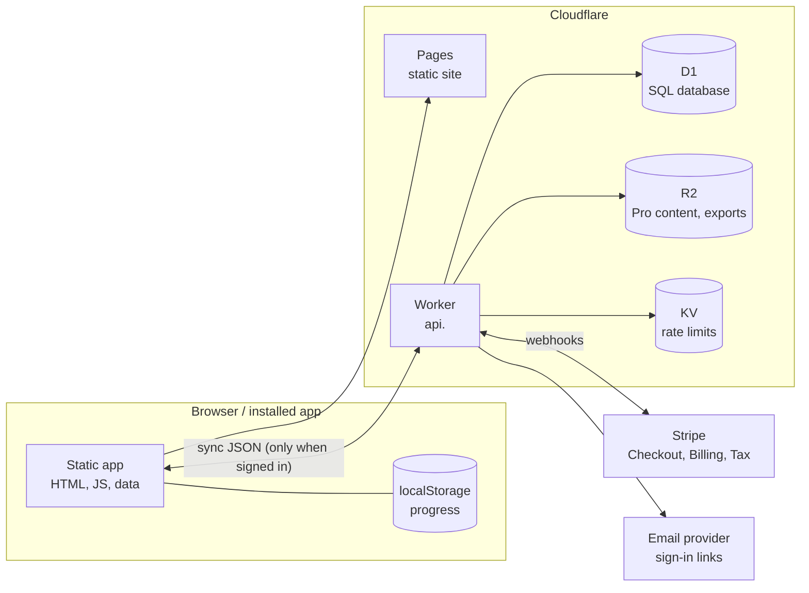

# Backend design: Pro tier and group licenses

Status: design sketch, not built. Covers monetization options 4 (Pro subscription) and 5
(group licenses for bootcamps, colleges and employers). Option 5 reuses everything in option 4.

## Goals and non-goals

**Goals**
- Keep the free site exactly as it is: no account, no cookies, progress in the browser.
- Pro: optional account that syncs progress across devices and unlocks extra content.
- Groups: organizations buy seats; instructors see their learners' progress.
- Stay small and cheap to run on the stack already in place (Cloudflare, GitHub Actions).
- Store as little personal data as possible, and make it easy to export and delete.

**Non-goals (for now)**
- Native iOS/Android apps: the installable web app covers phones.
- Hosting labs or VMs: labs keep running in the learner's own home lab.
- Proctored exams or official certification: we only do practice.

## Architecture



- **Static site stays static.** The app only talks to the API when someone signs in. Anonymous
  visitors make zero API calls, so the Privacy Policy's promise still holds for them.
- **One Cloudflare Worker** at `api.<domain>` (same site, separate origin) serves the JSON API.
  It is the only component with secrets.
- **D1** (SQLite) stores accounts, organizations, entitlements and synced progress.
- **R2** stores Pro-only content (extra question banks, printable packs) and data exports.
- **KV** holds rate-limit counters.
- **Stripe** handles all payments. We never touch card data (lowest PCI burden: SAQ A).
- **An email provider** sends sign-in links and receipts.

## Sign-in

- **Passkeys (WebAuthn) first**, with **email magic links** as the fallback. No passwords to
  store, leak or reset.
- Session: a random 256-bit token in an `HttpOnly; Secure; SameSite=Lax` cookie scoped to the
  API origin; only its SHA-256 hash is stored. 30-day sliding expiry; list and revoke sessions
  in settings.
- Magic links: single use, 15-minute expiry, bound to the requesting browser.
- **Organizations (option 5)** can add SSO later: SAML or OIDC through a managed provider, or
  Cloudflare Access, once a customer asks for it.

## Data model (D1)

```sql
-- people
users(id TEXT PK, email TEXT UNIQUE NOT NULL, created_at, deleted_at)
passkeys(id TEXT PK, user_id FK, public_key BLOB, sign_count INT, created_at, last_used_at)
sessions(token_hash TEXT PK, user_id FK, created_at, expires_at, user_agent)
magic_links(token_hash TEXT PK, email, expires_at, used_at)

-- money
subscriptions(id TEXT PK, user_id FK NULL, org_id FK NULL, stripe_customer TEXT,
              stripe_subscription TEXT, plan TEXT, status TEXT, seats INT, current_period_end)
entitlements(user_id FK, feature TEXT, source TEXT, expires_at, PRIMARY KEY(user_id, feature))
                    -- feature: 'sync' | 'pro_content' | 'org_member'; source: 'pro' | 'org:<id>'

-- groups (option 5)
orgs(id TEXT PK, name, created_at, sso_config JSON NULL)
org_members(org_id FK, user_id FK, role TEXT CHECK(role IN ('owner','instructor','learner')),
            PRIMARY KEY(org_id, user_id))
cohorts(id TEXT PK, org_id FK, name, cert_id TEXT, start_date, exam_date, lab_ids JSON)
cohort_members(cohort_id FK, user_id FK, PRIMARY KEY(cohort_id, user_id))
invites(code_hash TEXT PK, org_id FK, cohort_id FK NULL, role, expires_at, max_uses, uses)

-- synced progress: one row per user per document, mirroring localStorage keys
progress_docs(user_id FK, doc_key TEXT, body JSON, version INT, updated_at,
              PRIMARY KEY(user_id, doc_key))
                    -- doc_key: 'cert:security-plus', 'labs', …

-- accountability
audit_log(id INTEGER PK, at, actor_user_id, org_id NULL, action TEXT, target TEXT, ip_hash)
```

Instructor dashboards read **derived summaries** (accuracy per domain, labs finished, last
active), never raw lab notes. Notes stay private to the learner unless they choose to share.

## Progress sync

The app already keeps each certification's progress and the lab progress as JSON documents in
localStorage (`certhub:v1:<id>`, `certhub:v1:labs`). Sync uploads and downloads those same
documents, so the study code doesn't change.

- `GET /v1/progress` returns every doc with its `version`.
- `PUT /v1/progress/:docKey` sends `{ baseVersion, body }`. If `baseVersion` matches, the server
  stores it and bumps `version`; if not, it returns `409` with the server copy, and the client
  merges and retries.
- **Merge rules** (in `core.js`, shared by client and Worker):
  - checked study days, lab steps and verify checks: union (once checked, stays checked)
  - quiz stats: take the copy with more answered questions (`t`)
  - review queue: per question, keep the entry with the later `due`
  - history: union by timestamp, newest 60
  - lab notes: keep the most recently edited, and save the other as a conflict copy
  - lab `done`: earliest completion time wins
- Sync runs on sign-in, on app start, when the tab regains focus, and a few seconds after changes.
  Offline changes queue and upload later.

## API sketch

All JSON, versioned under `/v1`, same-site cookie auth, `Origin` checked on every write.

| Method and path | Who | Purpose |
|---|---|---|
| `POST /v1/auth/magic-link` | anyone | email a sign-in link (rate limited per IP and email) |
| `POST /v1/auth/magic-link/verify` | anyone | exchange link token for a session |
| `POST /v1/auth/passkey/{register,login}/{options,verify}` | user / anyone | WebAuthn ceremonies |
| `POST /v1/auth/logout` · `GET /v1/me` | user | sign out; who am I plus entitlements |
| `GET /v1/progress` · `PUT /v1/progress/:docKey` | `sync` | progress sync |
| `GET /v1/content/:certId/questions` | `pro_content` | extra question bank (signed R2 read) |
| `POST /v1/billing/checkout` | user | create Stripe Checkout session (Pro or seats) |
| `POST /v1/billing/portal` | user | Stripe customer portal (cancel, change card, invoices) |
| `POST /v1/stripe/webhook` | Stripe | subscription created, updated, deleted; payment failed |
| `POST /v1/orgs` · `POST /v1/orgs/:id/invites` | owner | create org; invite links or codes |
| `POST /v1/invites/:code/accept` | user | join an org or cohort |
| `GET/POST /v1/orgs/:id/cohorts` | instructor | create a cohort with cert, dates and assigned labs |
| `GET /v1/cohorts/:id/summary` | instructor | per-learner progress summary, CSV export |
| `GET /v1/account/export` · `DELETE /v1/account` | user | download everything; delete account |

## Payments (Stripe)

- **Pro**: monthly and yearly prices. Checkout → webhook → `subscriptions` row →
  `entitlements` (`sync`, `pro_content`). Cancellation keeps access until period end.
- **Groups**: per-seat subscription (quantity = seats) or a one-time invoice per cohort.
  Invites fail when seats run out; the owner adds seats in the portal.
- **Stripe Tax** for sales tax; **Customer Portal** for self-service; webhooks verified with
  the signing secret and processed idempotently (store event ids).
- Entitlements are computed server-side only; the client just hides or shows features.

## Security

- **Standard**: aim for OWASP ASVS Level 2.
- **Secrets**: Stripe keys, webhook secret and email API key live as Worker secrets, never in
  the repository or the static site.
- **Access control**: every query is scoped by `user_id` or checked `org_members.role`
  (tested with cross-tenant cases).
- **Abuse**: rate limits on auth and invite endpoints; generic responses to avoid account
  enumeration; Cloudflare WAF and bot protection on `api.`.
- **Browser**: the site's CSP gains exactly one `connect-src` entry for the API origin; cookies
  are `HttpOnly`, `Secure`, `SameSite=Lax`; CORS allows only the site origin with credentials.
- **Validation**: JSON bodies schema-validated and size-limited (progress docs ≤ 256 KB).
- **Monitoring**: audit log for sign-ins, role changes, exports and deletions; Workers logs with
  no request bodies or emails; alerts on webhook failures and error spikes.
- **CI**: the existing CodeQL, secret scanning and Dependabot cover the Worker too; add API tests
  (auth, tenant isolation, sync merge rules) to Study site CI.

## Privacy and compliance

- **Data minimization**: email address, passkey public keys, progress documents, billing
  references. No names required, no analytics, no ad tracking.
- **Rights**: self-serve export and deletion (deletion also removes Stripe customer data via API,
  keeping only what tax law requires on invoices).
- **Policies**: update the Privacy Policy and Terms before launch; add a refund policy and a
  data processing addendum for organizations.
- **Schools**: student records may fall under FERPA; offer a standard agreement, keep instructor
  views to progress summaries, and never sell or share data.
- **Children**: Pro and group accounts are for users 13+ (COPPA); K-12 programs need a separate
  review before selling to them.
- **Accessibility**: WCAG 2.1 AA for the dashboard (institutions will ask).

## Costs (rough, early stage)

| Item | Cost |
|---|---|
| Cloudflare Workers Paid (includes generous D1, KV, R2 usage) | about $5/month |
| Domain | about $10/year |
| Email provider | free tier to a few dollars a month at low volume |
| Stripe | about 2.9% + 30¢ per card payment, plus Stripe Tax fees |

At a few hundred users the whole backend should cost under $20 a month.

## Build order

1. **Accounts and sync**: magic links, then passkeys; progress sync with merge rules; export
   and delete. Offer sync free during a beta to test it.
2. **Pro**: Stripe Checkout, webhooks, entitlements, portal; gated extra question banks.
3. **Groups pilot**: orgs, invites, cohorts, instructor summary and CSV. Pilot free with one
   bootcamp cohort and measure practice scores and labs finished.
4. **Groups for sale**: per-seat billing, invoices, DPA and FERPA terms, optional SSO.

## Open questions

- Pricing: monthly versus yearly Pro; per-seat versus per-cohort for groups.
- Should learners be able to share their lab notes with an instructor (opt-in per lab)?
- Which email provider, and from which address (needs the domain first)?
- Business entity, tax registration and refund terms before taking the first payment.
